```{=html}
<style type="text/css">
/* Cascading Style Sheets (CSS) is a stylesheet language used to
describe the presentation of a document written in HTML or XML. it is
a simple mechanism for adding style (e.g., fonts, colors, spacing) to
Web documents. */
h1.title { /* Title - font specifications of the report title */
 font-size: 24px;
 color: DarkRed;
 text-align: center;
 font-family: "Gill Sans", sans-serif;
}
h4.author { /* Header 4 - font specifications for authors */
 font-size: 20px;
 font-family: system-ui;
 color: DarkRed;
 text-align: center;
}
h4.date { /* Header 4 - font specifications for the date */
 font-size: 18px;
 font-family: system-ui;
 color: DarkBlue;
 text-align: center;
}
h1 { /* Header 1 - font specifications for level 1 section title */
 font-size: 22px;
 font-family: "Times New Roman", Times, serif;
 color: navy;
 text-align: center;
}
h2 { /* Header 2 - font specifications for level 2 section title */
 font-size: 20px;
 font-family: "Times New Roman", Times, serif;
 color: navy;
 text-align: left;
}
h3 { /* Header 3 - font specifications of level 3 section title */
 font-size: 18px;
 font-family: "Times New Roman", Times, serif;
 color: navy;
 text-align: left;
}
h4 { /* Header 4 - font specifications of level 4 section title */
 font-size: 18px;
 font-family: "Times New Roman", Times, serif;
 color: darkred;
 text-align: left;
}
body { background-color:white; }
.highlightme { background-color:yellow; }
p { background-color:white; }
</style>
```


# Introduction

A Portuguese banking institution used direct marketing campaigns to gather personal and banking information about their clients. The overall goal of this study is to predict if a client will subscribe to a term deposit after direct marketing campaigns of a Portuguese banking institution. Three different kinds of models, logistic regression, neural network, and decision tree, will be created for the purpose of predicting if a client will subscribe a term deposit. The best of these three models will be accepted as the best model overall for this prediction.

{width=70%}

Before any modeling is done, we will look at the data set and do exploratory data analysis (EDA) to look at the distribution and trends of the variables. Some variables, whether numeric or categorical, may be re-categorized based off the results to be used for modeling instead of the original variables. Association between variables will then be looked at through pairwise association and mosaic plots, and variables that seem to hinder the data will be dropped. This fixed data set will be make training and testing data sets to find optimal cut-off probabilities for assessing the accuracy of the different models created. ROC curves will also be created to look at the performance of the different models. The areas under the curves (AUCs) will help to determine which model created is the best model to use for this data set.

# Bank Direct Marketing Data Set Description

The data used for this study comes from direct marketing campaigns of a Portuguese banking institution. These marketing campaigns were based on phone calls, and often, more than one contact was required to the same client to access if the term deposit was subscribed. The data is ordered by date, from May 2008 to November 2010. The data was found at the UC Irvine Machine Learning Repository.

There is a total number of 45,211 client records in this data set. The data set consists of 17 variables, including the response variable with the name 'y'. A detailed description of the predictor and outcome variables are given below:

1 - age (numeric)

2 - job : Job type (categorical): "admin.", "unknown", "unemployed", "management", "housemaid",        "entrepreneur", "student", "blue-collar", "self-employed", "retired", "technician", "services"

3 - marital : Marital status (categorical): "married", "divorced", "single"
  note: "divorced" means divorced or widowed
  
4 - education (categorical): "unknown","secondary","primary","tertiary"

5 - default: Does the client have credit in default? (binary: "yes","no")

6 - balance: Average yearly balance (numeric, in euros)

7 - housing: Does the client have a housing loan? (binary: "yes","no")

8 - loan: Does the client have a personal loan? (binary: "yes","no")

9 - contact: Contact communication type (categorical): "unknown","telephone","cellular"

10 - day: Last contact day of the month (numeric, discrete)

11 - month: Last contact month of year (categorical): "jan", "feb", "mar", "apr", "may", "jun", "jul",  "aug", "sep", "oct", "nov", "dec"

12 - duration: Last contact duration (numeric, in seconds)

13 - campaign: The number of contacts performed during this campaign and for this client (numeric, discrete)

14 - pdays: The number of days after the client was last contacted from a previous campaign (numeric, discrete)    note: -1 means client was not previously contacted

15 - previous: The number of contacts performed before this campaign and for this client (numeric)

16 - poutcome: The outcome of the previous marketing campaign (categorical): "unknown", "other",          "failure", "success"

17 - y (outcome response variable): Has the client subscribed a term deposit? (binary: "yes","no")

A copy of this publicly available data is stored at: https://archive.ics.uci.edu/dataset/222/bank+marketing


# Exploratory Data Analysis for Feature Engineering

Exploratory data analysis (EDA) for feature engineering will be done to look at the distribution of variables and observe patterns. Changes will be made to the variables based off the results, and these fixed variables will be used for future modeling. 

First, the entire data set will be scanned to determine the EDA tools to use for feature engineering. Then, if there is missing values, the data will be imputted. Afterwards, if numeric or categorical variables are skewed, they will be re-categorized, where there values are split into new groups or categories. These new variables will be used in future modeling instead of the original variables. A final data set will then be created using these transformed variables. Finally, with this fixed data set, linear association and correlation between numeric variables, as well as dependency on the response variable for categorical variables, will be investigated. 


By looking at a few descriptive statistics for every variable of the data set, it can be observed that the distributions of some numeric and categorical variables are skewed and contain outliers. 

## Missing Values of the Data Set

There appears to be no missing values in this data set. Therefore, there is no need to use any methods regarding the imputation or deletion of missing values.

## Assessing Distributions of the Variables

Now, we will look at possibly re-categorizing the numeric variables, both continuous and discrete, and existing categorical variables of the study. These re-structured variables will be used in place of the original ones.

### Discretizing Continuous Variables

To deal with the outliers and skewness of certain numerical variables, such as duration of the last contact, shown in the histogram below, re-categorization will be used to divide the different values into groups. This variable should be re-categorized due to the great number of high outliers, which in turn leads to great skewness. In looking at this variable's distribution, the three groups that were created (0-180, 181-319, and 320+) seem similar enough in the frequency of client observations. This variable will be used for future models.

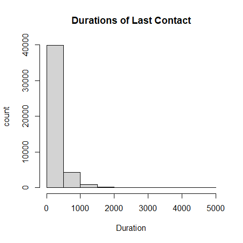

### Grouping Categories for Discrete Numeric Variables

Now, let's look at bar plots for three discrete numerical variables: campaign, pdays, and previous, and re-categorize them as well.

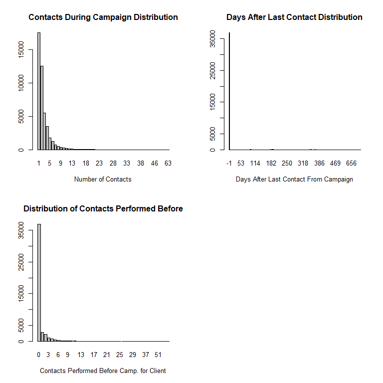

Overall, the bar plots are greatly skewed and/or weighted for certain values, so category groups should be made for each variable. 

For campaign, the value of 1 contact should be its own group since it has the highest frequency of observations. The Values of 2 and 3 contacts combined have a similar frequency, so this should be a second group. The rest of the observations from 4 contacts and up together act as a third group since they more or less add up to a similar frequency as the first two groups. 

As for pdays, the value of -1 for this variable acts as an indicator that a client was not previously contacted. Due to this fact, and the fact that it makes up most of the observations as well, this will be its own group. The rest of the observations were split into groups of 1-200 days and 200 days or more. The value of 200 seemed like a decent splitting point due to how the distribution looked on the bar plot.

The previous variable was also split into 3 groups. The value of 0 contacts is one group since it has the most observations. The values of 1 to 3 contacts is another category since they both make a fair amount of the observations. Same goes for observations with 4 or more contacts.

These grouped variables will be used in subsequent modeling. The categories for each variable are as follows:

campaign: 1, 2-3, 4+

pdays: -1, 1-199, 200+

previous: 0, 1-3, 4+


### Regrouping Categorical Variables

The bar plot for the month variable also shows that the distribution of this variable is skewed in favor of warmer seasons like spring (specifically may) and summer (jun, jul, aug). As such, this categorical variable should be re-categorized by season (winter, spring, summer, fall).

The job variable also has sparse categories that may affect the results of subsequent modeling. Therefore, it may be beneficial to group them in a more meaningful way to make a more powerful feature variable. They are now split between four new categories, depending on the type of job:

not working (or does not currently have a job) = unemployed, unknown, retired, student

Workers (standard jobs/blue-collar workers) = blue-collar, housemaids

bosses (running own company) = entrepreneur, management, self-employed

white-collar (white-collar type jobs) = services, admin., technician

Both of these discretized variables will be used for modeling.

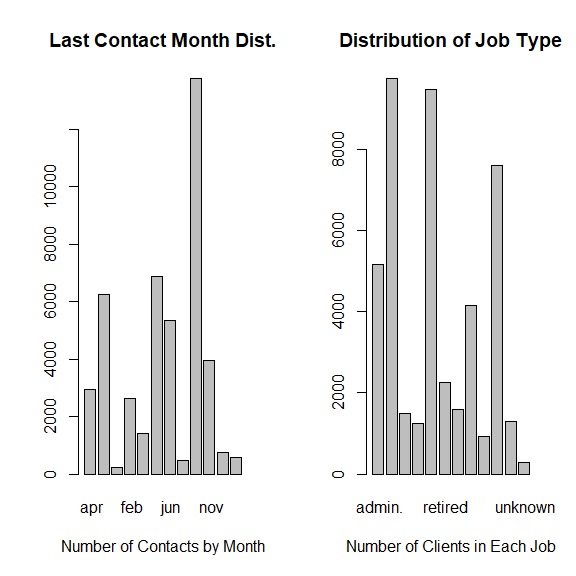

## Pairwise Associations

Now that these variables have been re-categorized, they will be kept for use in subsequent modeling instead of the original versions. It is time to look at association between numeric variables and dependency of categorical variables to the response.


### Correlation of Numerical Variables

A pair-wise scatter plot is used for assessing pairwise linear association between two numeric variables at a time.

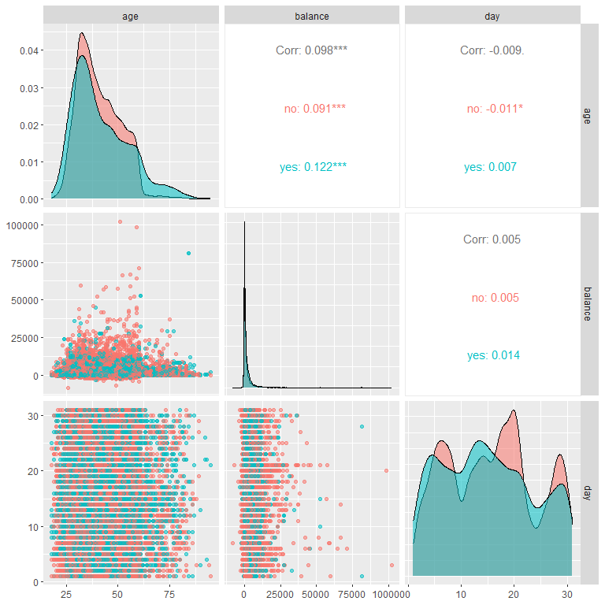

The off-diagonal plots and numbers indicate the correlation between was weak and not what was expected, None of the numerical variables appear to be significantly correlated to each other.

The stacked density curve for balance shows that distributions of balance in the yes and no response categories are essentially identical. This would imply that balance might not associated with the response variable. Therefore, it should probably be removed from the modeling data set. As for the other variables, the curves are mostly but not completely overlapped, this means there is correlation between each of these numeric variables and the response variable (y), but it's not a lot.

There is almost no correlation between day and the other variables, but there is a somewhat better correlation between age and balance, even though it is still very weak.

### Dependency of Categorical Variables

These mosaic plots help show whether clients subscribing a term deposit is independent of the categorical variables. Variables that are independent should be excluded in future models.

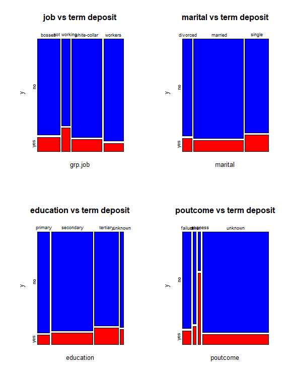

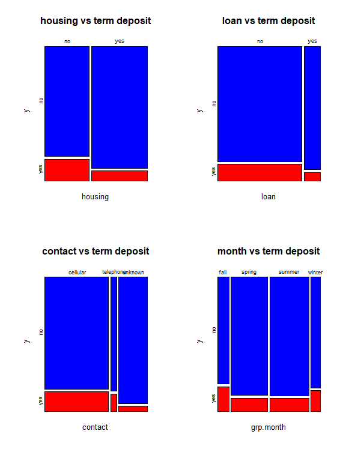

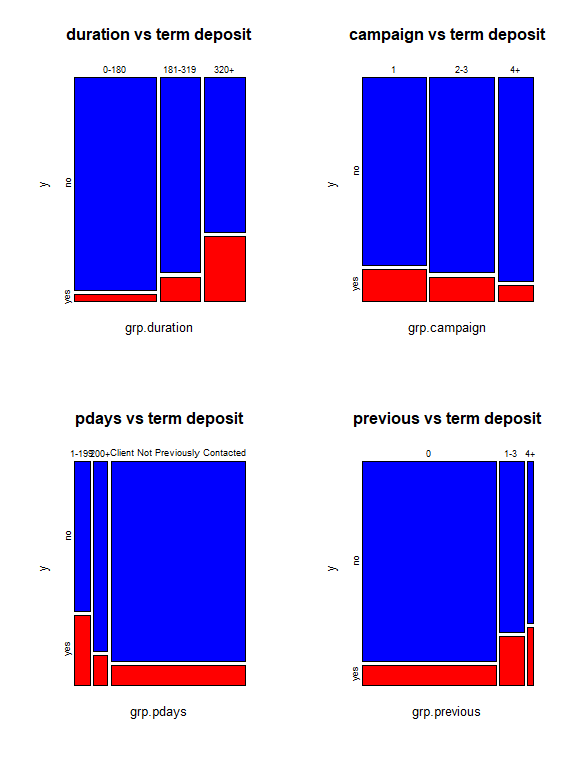

The mosaic plots for contact, pdays, and education show negative association between contact communication type, client education, and number of days passed after the client was last contacted from a previous campaign. Most of these mosaic plots show that whether the client subscribed a term deposit is not independent of times of these variables because the proportion of subscription cases in individual categories is not identical. 

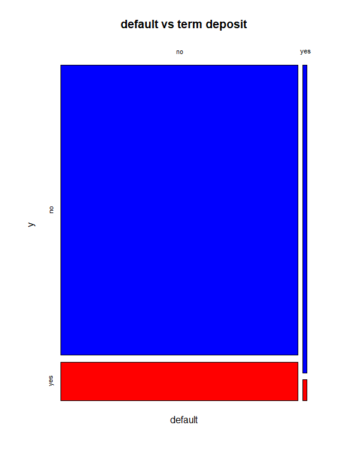


It should be said that the mosaic plot for the default variable showed the yes category was extremely small compared to the no category. Only 815 (1.8%) clients of the 45211 total had credit in default, according to this data. This category of the default variable having only a few subscribers could cause instability with estimating model parameters. The same can be sadi for the poutcome variable, which also has a small category for "other". Therefore, it might be better to not include these two variable in subsequent modeling.

# Predictive Modeling with Logistic Regression

In this section, the revised data set created through the EDA done above will be used to run different logistic regression models. An optimal final model will be found from these models, which will be used to calculate probabilities for predicting whether or not a client has subscribed a term deposit after direct marketing campaigns.

The variable, y, which tells whether a client has subscribed a term deposit, acts as the binary reponse variable of all the models. The rest of the variables, including the new re-categorized variables, of the revised data set act as the predictor variables that will possibly affect the response.

## Methodology for Modeling

In order to perform proper modeling, some categorical and binary variables had to be changed, including the response (y) and the ones changed in the EDA, to have numerical labels, thereby making them easier to use for modeling.

The first logistic regression model that will be built is an initial full model that contains all predictors variables of the data set. Automatic variable selection will then be used to find a final model. In looking at the p-values of the variables in the initial model, those that are insignificant at the 0.05 level will be dropped. The variables remaining that are either statistically significant or important for the model will be used to create a sort of reduced model. A third and final model, that is between the full and reduced models, will then be found. Performance of predictive power will be analyzed for all predictor variables as well as their association to the response. Finally, this final model will be used to calculate predictive probability for values of the response variable. When values of predictor values are entered, the predicted value of whether or not a client has subscribed a term deposit (either Yes or No) is given.

## Turning Text Categorical and Binary Variables into Disrete Numerical Variables for Modeling

The values of the response variable, y, (yes/no), along with certain binary and categorical variables, must be changed to have numerical labels here. This is the only way the logistic regression models can be created properly. The labels are as follows:

y (response): 0=no, 1=yes

grp.job: 0=not working, 1=workers, 2=bosses, 3=white-collar

marital: 0=divorced, 1=single, 2=married

education: 0=unknown, 1=primary, 2=secondary, 3=tertiary

housing: 0=no, 1=yes

loan: 0=no, 1=yes

contact: 0=unknown, 1=telephone, 2=cellular

grp.month: 0=winter, 1=spring, 2=summer, 3=fall

grp.duration: 0=(0-180), 1=(181-319), 2=320+

grp.campaign: 0=1, 1=(2-3), 2=4+

grp.pdays: 0=Client Not Previously Contacted, 1=(1-199), 2=200+

grp.previous: 0=0, 1=(1-3), 2=4+


## Building the Three Candidate Logistic Regression Models

The full model containing all usable predictor variables of the data set will be made first, with the variable, y (whether or not a client has subscribed a term deposit), as the response. The variables balance, default, and poutcome are not included since the EDA showed that removing them from the model might help the results.


Table: Significance tests of logistic regression model

|              |   Estimate| Std. Error|     z value| Pr(>&#124;z&#124;)|
|:-------------|----------:|----------:|-----------:|------------------:|
|(Intercept)   | -3.6496639|  0.1591910| -22.9263222|          0.0000000|
|age           |  0.0038409|  0.0017754|   2.1633458|          0.0305146|
|day           | -0.0067231|  0.0020538|  -3.2735587|          0.0010620|
|grp.job1      | -0.5436649|  0.0626220|  -8.6816844|          0.0000000|
|grp.job2      | -0.4510442|  0.0601704|  -7.4961181|          0.0000000|
|grp.job3      | -0.3621641|  0.0548353|  -6.6045832|          0.0000000|
|marital1      |  0.1635389|  0.0612123|   2.6716674|          0.0075475|
|marital2      | -0.1794432|  0.0537875|  -3.3361508|          0.0008495|
|education1    | -0.2613401|  0.0940029|  -2.7801268|          0.0054338|
|education2    | -0.1230675|  0.0830821|  -1.4812759|          0.1385331|
|education3    |  0.1805890|  0.0867834|   2.0809163|          0.0374416|
|housing1      | -0.8169480|  0.0393554| -20.7581975|          0.0000000|
|loan1         | -0.5359299|  0.0542115|  -9.8859174|          0.0000000|
|contact1      |  0.9917203|  0.0830659|  11.9389553|          0.0000000|
|contact2      |  1.0544195|  0.0537048|  19.6336113|          0.0000000|
|grp.month1    |  0.3106732|  0.0592779|   5.2409651|          0.0000002|
|grp.month2    |  0.0478258|  0.0567647|   0.8425279|          0.3994925|
|grp.month3    |  0.2335808|  0.0640737|   3.6455004|          0.0002669|
|grp.duration1 |  1.3281527|  0.0503637|  26.3712173|          0.0000000|
|grp.duration2 |  2.6986440|  0.0458796|  58.8201523|          0.0000000|
|grp.campaign1 | -0.3072754|  0.0367103|  -8.3702719|          0.0000000|
|grp.campaign2 | -0.4754206|  0.0516225|  -9.2095582|          0.0000000|
|grp.pdays1    |  1.4232575|  0.0766976|  18.5567509|          0.0000000|
|grp.pdays2    |  0.5435385|  0.0881020|   6.1694199|          0.0000000|
|grp.previous1 | -0.2154700|  0.0778542|  -2.7676102|          0.0056469|

It appears that some p-values in the above significance test table are bigger than 0.5 for some levels of predictor variables, but not all.

Some of the insignificant predictor variables will now be dropped, using automatic variable selection, in finding the reduced model. The final best model, outlined below, will be a model that is between the full and reduced models. In this case, it seems to contain all the predictor variables used for the initial model as well.


Table: Summary table of significant tests

|              |   Estimate| Std. Error|     z value| Pr(>&#124;z&#124;)|
|:-------------|----------:|----------:|-----------:|------------------:|
|(Intercept)   | -3.6496639|  0.1591910| -22.9263222|          0.0000000|
|age           |  0.0038409|  0.0017754|   2.1633458|          0.0305146|
|day           | -0.0067231|  0.0020538|  -3.2735587|          0.0010620|
|grp.job1      | -0.5436649|  0.0626220|  -8.6816844|          0.0000000|
|grp.job2      | -0.4510442|  0.0601704|  -7.4961181|          0.0000000|
|grp.job3      | -0.3621641|  0.0548353|  -6.6045832|          0.0000000|
|marital1      |  0.1635389|  0.0612123|   2.6716674|          0.0075475|
|marital2      | -0.1794432|  0.0537875|  -3.3361508|          0.0008495|
|education1    | -0.2613401|  0.0940029|  -2.7801268|          0.0054338|
|education2    | -0.1230675|  0.0830821|  -1.4812759|          0.1385331|
|education3    |  0.1805890|  0.0867834|   2.0809163|          0.0374416|
|housing1      | -0.8169480|  0.0393554| -20.7581975|          0.0000000|
|loan1         | -0.5359299|  0.0542115|  -9.8859174|          0.0000000|
|contact1      |  0.9917203|  0.0830659|  11.9389553|          0.0000000|
|contact2      |  1.0544195|  0.0537048|  19.6336113|          0.0000000|
|grp.month1    |  0.3106732|  0.0592779|   5.2409651|          0.0000002|
|grp.month2    |  0.0478258|  0.0567647|   0.8425279|          0.3994925|
|grp.month3    |  0.2335808|  0.0640737|   3.6455004|          0.0002669|
|grp.duration1 |  1.3281527|  0.0503637|  26.3712173|          0.0000000|
|grp.duration2 |  2.6986440|  0.0458796|  58.8201523|          0.0000000|
|grp.campaign1 | -0.3072754|  0.0367103|  -8.3702719|          0.0000000|
|grp.campaign2 | -0.4754206|  0.0516225|  -9.2095582|          0.0000000|
|grp.pdays1    |  1.4232575|  0.0766976|  18.5567509|          0.0000000|
|grp.pdays2    |  0.5435385|  0.0881020|   6.1694199|          0.0000000|
|grp.previous1 | -0.2154700|  0.0778542|  -2.7676102|          0.0056469|

## Predictive Probability Analysis for Clients Subscribing Term Deposits

Now that a final model has been created, it will be used to predict whether or not a client has subscribed a term deposit based on given values of the predictor variables in the final model associated with two clients. A threshold probability of 0.5 is used to predict the response value.

The predicted answers for whether or not the client has subscribed a term deposit for two clients with the following information will be attached to the two new data records. The first banking client will subscribe a term deposit while the second one will not.


Table: Predicted Value of Response With Given Cut-Off Probability

| age| day|grp.job |marital |education |housing |loan |contact |grp.month |grp.duration |grp.campaign |grp.pdays |grp.previous | Pred.Response|
|---:|---:|:-------|:-------|:---------|:-------|:----|:-------|:---------|:------------|:------------|:---------|:------------|-------------:|
|  58|   5|1       |2       |3         |1       |0    |1       |3         |2            |0            |1         |1            |             1|
|  44|   5|1       |1       |1         |0       |0    |0       |2         |1            |0            |2         |0            |             0|

# Assessing the Logistic Regression Models With Different Model Performance Measures

Next, the data set used for modeling in the previous section will be split into two data sets, training and testing, for training models and testing the final model, respectively. Candidate models, one training model and one testing model, will be made from these data sets. Using cross-validation, an optimal cut-off probability will be found from these models. This cut-off will be used with the testing data set to look at performance and accuracy of the model. The data will be split into sub-intervals based on cut-offs, which will then be used to report local measures of performance for the model, including sensitivity and specificity. Global measures, mainly ROC curves, will also be created for all three models to judge model performance.

## Finding Model Preformance Accuracy with Cross-Validation

### Splitting the Data Into Training and Testing Data Sets

With the sample size being so large, we will randomly split the overall data set into two data sets. 70% of the data will be put in a training data set for training and validating models. The other 30% goes into a testing data set for testing the final model. The value labels of the response (yes/no) used for testing and validation data will be removed when calculating the accuracy measures later.


### Finding the Optimal Cut-off Probability

Now a sequence of 20 candidate cut-off probabilities will be defined. Then, a 5-fold cross-validation will be used to identify the optimal cut-off probability for the final prediction model. The first candidate model, the training model, will be created in the process.

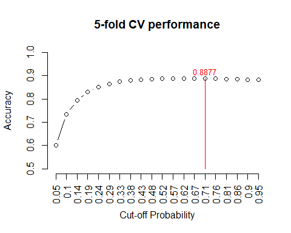

The above figure indicates that the optimal cut-off probability that yields the best accuracy is 0.62.

### Model Performance Reporting Test

This subsection is focused on reporting performance of the model using the test data set. The testing model needs to be fit to the original training data to find the regression coefficients. The holdout testing sample will be used to find the accuracy.


| test.accuracy |
|:-------------:|
|   0.8860871   |

The accuracy is around 88-89%. This indicates that there is no under-fitting for the final logistic regression model.

## Calculating Local and Global ROC Performance Metrics for Logistic Predictive Models

### Local Performance Measures Analysis

Using the optimal cut-off probability of 0.62, we will now report the local measures using the testing data set. This includes specificity and sensitivity based on each of these cut-offs for the 20 sub-intervals.


Table: Local Performance Metrics

| sensitivity | specificity | precision |  recall   |    F1     |
|:-----------:|:-----------:|:---------:|:---------:|:---------:|
|  0.1012422  |  0.9918012  | 0.6245211 | 0.1012422 | 0.1742384 |

The sensitivity indicates the probability of those clients who are said to have subscribed a term deposit at the banking institution out of those who actually did is about 8-12%. The specificity indicates the probability of those clients who are said to have not subscribed a term deposit at the banking institution out of those who actually did not is about 99%. 

### ROC Global Measure Analysis

For the last part of this section, a ROC (receiver operating characteristic) curve will be plotted by selecting a sequence of decision thresholds and calculating corresponding sensitivity and specificity. 

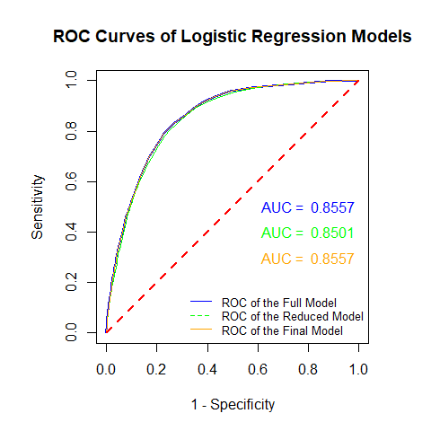

The above ROC curves indicate that the underlying predictive models are all better than the random guess (in red) since the area under the curve (AUC) is significantly greater than 0.5 for all curves. Since all these AUCs are also significantly greater than 0.65, this means the predictive power of all three underlying models is acceptable.

The area under the curve (AUC) for the reduced model ROC curve is less than the other two graphs. Higher AUC indicates the model for that curve is better. Therefore, the reduced model is worse than the other two.

As for the other two models, they more or less share the same curve since both models contain all feature variables used in the initial model. Out of these other two models, the final model works better compared to the initial model. This model has been proven to be accurate in modeling performance, has high specificity, and its ROC curve is remaining away from the 45 degrees mark. Plus, the AUC is fairly high, even if the initial model has the same one.

# Modeling With the Neural Network Method

Now that one predictive model has been created, another model, a single-layer neural network model will be created and compared to the first model. Perceptron, an artificial neural network, is used in this model. Every input variable has a weight, like a coefficient in regression, and a bias term is also added to these inputs to give perceptron with flexibility, acting as a sort of regression intercept. The output is binary, either 0 or 1, determined by an activation function made up of the inputs and bias.

Training and testing data sets and models will be made once again for the neural network model. From them, a final model will be constructed and plotted to show back-propagation of the neural network model. Also, like with the previous model, cross-validation will be used for finding an optimal cut-off probability for assessing model performance and accuracy. Lastly, an ROC curve will be made for the model to look at predictive power and compare it to the other model.

## Converting the Variables to Numeric Form

First off, the neuralnet library in R requires feature variables to be in numeric form. Numerical feature variables should be scaled in order to be normalized for the model. Categorical variables become explicitly defined dummy variables. We want to be able to find all names for the feature variables and write them in the neural network model formula. The data set here will not include the numerical labels for the categorical variables as with the previous model.


The numerical variables of age and day are scaled here. The unitless variable scale used is:

$$
scaled.var = \frac{orig.var - \min(orig.var)}{\max(orig.var)-\min(orig.var)}
$$


As for the categorical variables, using the model.matrix() function, the names of all these feature variables, and their levels, used in the model will be extracted. There are naming issues in the dummy variables, so they should be renamed, by erasing spaces or special characters, to properly build the neural network model.


## Building and Plotting the Neural Network Model

Here the neural network model is defined using the changed names of the variables in the matrix. The data is then split again into two data sets. 70% is for training the neural network model and 30% is for testing. Using these two new data sets, a single-layer neural network model is created using the neuralnet() function.


The following is a plot showing the architecture of this single-layer neural network, known as perceptron.

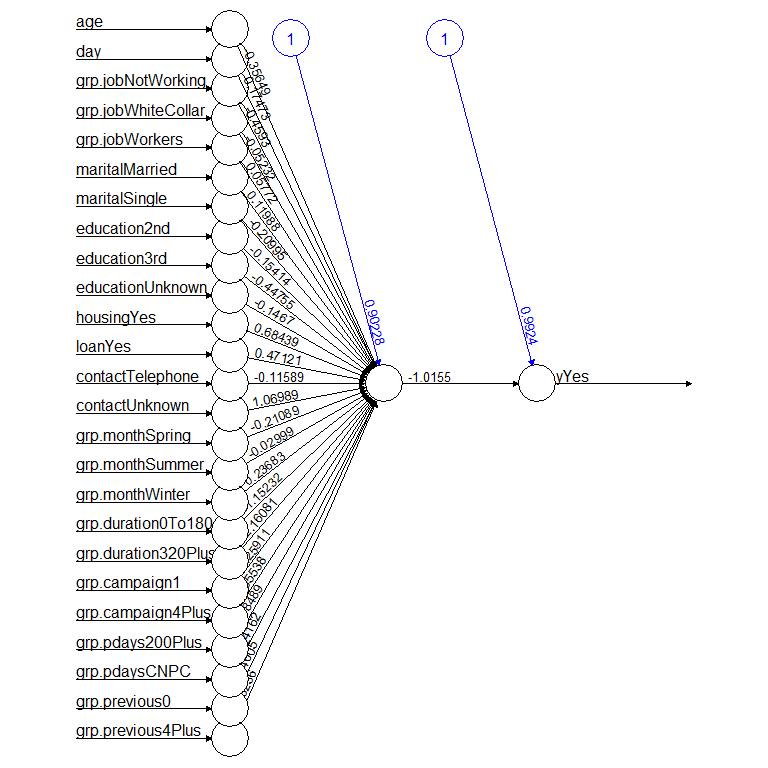

## Testing Performance of the Neural Network Model

### Finding the Optimal Cut-Off Score Using Cross-Validation

Here, optimal cut-off scores for the binary decision can be obtained through cross-validation. This, along with the use of hyper-parameters, will be used to assess model accuracy and performance.

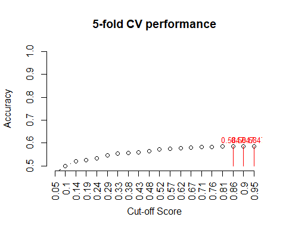

The above figure indicates that the optimal cut-off probability that yields the best accuracy is around 0.86.

### Testing Model Accuracy and Performance

This optimal cut-off probability and testing data will now be used to look at the accuracy, like with the previous model, and confusion matrix of the model.


| accuracy |
|:--------:|
| 0.883089 |

The accuracy is 88%. This accuracy indicates that there is no under-fitting for the final model. This is quite similar compared to the logistic regression model from the previous section.

The sensitivity indicates the probability of those clients who are said to have subscribed a term deposit at the banking institution out of those who actually did is 100%. The specificity indicates the probability of those clients who are said to have not subscribed a term deposit at the banking institution out of those who actually did not is 0%. 

## ROC Analysis

Now a ROC will be constructed for the neural network model based on the training data set.

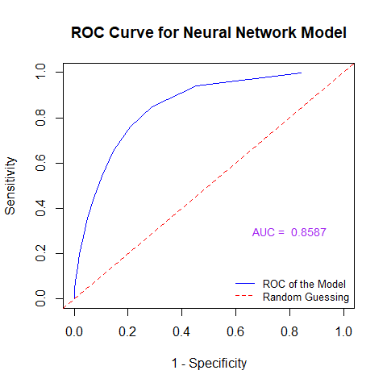

The above ROC curve indicates that the underlying neural network is better than the random guess since the area under the curve (AUC) is significantly greater than 0.5. Since the AUC is also significantly greater than 0.65, this means the predictive power of the underlying model is acceptable. Since the AUC for the neural network model ROC curve is less than that of the final logistic regression model, this model is not as good as the logistic regression model.

# Modeling With Decision Tree Algorithms

Now that two models, logistic regression and neural network, have been created, a final third predictive model, based on decision tree algorithms, will be made as well. Decision trees are based on conditional probabilities statements, known as rules, to identify certain sets of records to be used to make a prediction of the response for a new observation. It starts off from a root node, representing the whole data population or a sample. The decision tree grows from this root node by splitting into branches of decision sub-nodes, which continue to split into more, and leaf sub-nodes, which do not split further, of the data, using criteria defined by the feature variables. Predictive performance of a decision tree is dependent on the trained tree size. Small size causes underfitting of the model and large size causes overfitting. The Gini index and information entropy are two impurity measures used to control size of a decision for obtaining best performance. They also choose feature variables for defining root and decision nodes, as well as how to split the variables. Gini Index considers a split for each attribute and measures the impurity of subgroups split by a feature variable.

Overall, decision trees are relatively easy to understand and are effective. They show all possible outcomes and give users the ability to analyze possible consequences of a decision. This gives users the ability to find the optimal model with the greatest predictive performance and the least amount of problems.

At least 4 to 6 different decision trees will be initially constructed based on impurity measures (Gini index and information entropy), penalty coefficients, and costs of false negatives and positives. An ROC curve will once again be used to find the best decision tree model out of all of them. An optimal cut-off score will be found again from this through cross-validation for reporting predictive performance of the final model. 

{width=70%}

The original data set, with the re-categorized variables, will be used, separate from the logistic regression and neural network models. This, once again, will be split into a 70% data set for training the model and a 30% data set for testing the model.


## Building Decision Trees With Purposes


A wrapper will be implemented, using an R function, in order to pass arguments of impurity and penalty measures, as well as costs of false positives and negatives, to construct different decision trees. This function will help define six different initial decision tree models:

Model 1: gini.tree.11 is based on the Gini index without penalizing false positives and false negatives.

Model 2: info.tree.11 is based on entropy without penalizing false positives and false negatives.

Model 3: gini.tree.110 is based on the Gini index: cost of false negatives is 10 times the positives.

Model 4: info.tree.110 is based on entropy: cost of false negatives is 10 times the positives.

Model 5: gini.tree.101 is based on the Gini index: cost of false positive is 10 times the negatives.

Model 6: info.tree.101 is based on entropy: cost of false positive is 10 times the negatives.


Call statements will be used to fit parameters into the tree model wrapper that was just created with the above code, allowing the creation of several different tree models. 

It appears, however, that the two non-penalized models will not run properly for the analysis and produce full models. This is because the cost of false negatives is significantly different from the cost of false positives. Due to the nature of this data set, any tree model created must have penalty measures to account for this difference in costs. 

The first two plots given here show the two penalized decision models where cost of false negative is 10 times the positives.

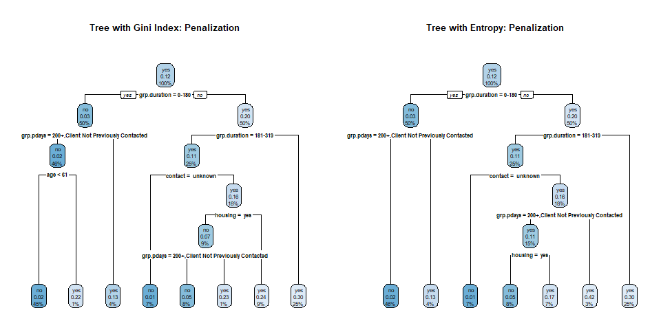

Unfortunately, it seems the last two penalized decision models where cost of false positive is 10 times the negatives will also not run properly for the analysis or produce full models. This could be due to the built-in stopping rule. It may indicate, based on penalizing weights, no significant information gain for any plotting beyond the root node. It could also be the default controls are too restrict for your case. Many attempts, however, have been done to change the controls to make these two models work, but nothing worked. Therefore, it would be better to focus on just the two models of false negatives for this analysis.

## ROC for Final Decision Tree Model Selection

Now that the two decision trees have been created, the ROCs of both these curves, and their AUCs, will now be used to select the optimal decision tree model of the two to compare with the other two models in the previous sections. A new function will be used to build 2 different trees and plot their corresponding ROC curves, and calculate the AUCs for each, so we can see the global performance of these tree algorithms.

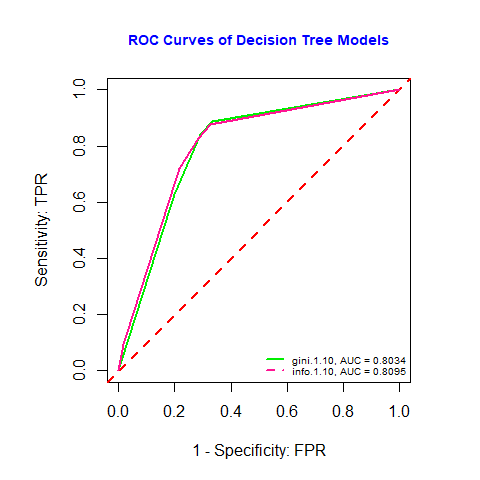

The above ROC curves represent the two decision trees for the penalized models with false negatives and their corresponding AUCs. They indicate that the underlying predictive models are both better than the random guess since the area under the curve (AUC) is significantly greater than 0.5 for all curves. Since all these AUCs are also significantly greater than 0.65, this means the predictive power of all three underlying models is acceptable.

The Gini index model will be the final model used for finding the optimal cut-off probability for predictive modeling since it has the largest AUC out of the two curves most of the time, even though they are similar the rest of the time. It seems to have a smaller AUC compared to the ROC curves of the other two models, suggesting this model is worse compared to them.

## Final Decision Tree Model Optimal Cut-Off Score Determination

With the final decision tree model established, the optimal cut-off score must be determined for reporting predictive performance. This will be done using the test data and cross-validation based on the training data set. 

Of course, when making different decision tree models, one may end up with 2 or more models having similar AUCs. To counteract this, a function will be written to determine optimal cut-off for each of the 2 given decision trees (based on this project) since different trees have their own optimal cut-off. The average of the cut-offs for both models will be used for predictive performance. 

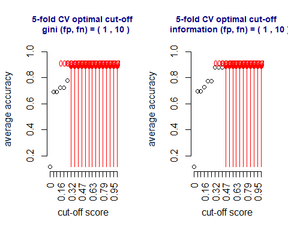

The above figure indicates that the optimal cut-off probabilities for the Gini index (left) and entropy (right) models are relatively the same in range. Therefore, I believe the optimal average cut-off probability that yields the best accuracy for the final Gini index model is around 0.74.

## Discussion of Decision Tree Models

Overall, out of the six initial decision tree models, only the two false negative models ended up being usable for predictive modeling. The cost of false negatives was significantly different from the cost of false positives, so all the tree models created needed to have penalty measures to account for these differences. This resulted in both non-penalized models failing. The false positive models also appear to have no significant information gain for any plotting, probably due to the built-in stopping rule. The default controls could also be to blame if they were still too restricted.

The penalized Gini index model where the cost of false negatives is 10 times the positives proved to be the best model out of all the decision tree models. This was due in part to its ROC curve having a greater AUC than for the other false negatives model with information entropy. The average optimal cut-off probability for this final tree model is 0.74, which can be used to assess model performance and accuracy in the future.

# Conclusion

Overall, the data seemed to function better for modeling with the variables balance, default, and poutcome removed and the variables duration, campaign, pdays, previous, job, and month re-categorized. Out of the three logistic regression models, the final model, existing between the full and reduced models, appeared to be the best of the three since its AUC was the highest among these models. The final model does contain all the variables that were in the full model, so it is the same. It is uncertain whether a third, different model existed that was better than the final model. Both this model and the neural network model appear to have strong accuracy in predicting clients subscribing a term deposit. The Gini index decision tree was the best of the two tree models since its AUC was the bigger of the two for the ROC curves. It was planned that there would be four more, but the two non-penalized models did not work since  the cost of false negatives is significantly different from the cost of false positives. The two false positive models did not work either due to the built-in stopping rule and no significant information gain from plotting.

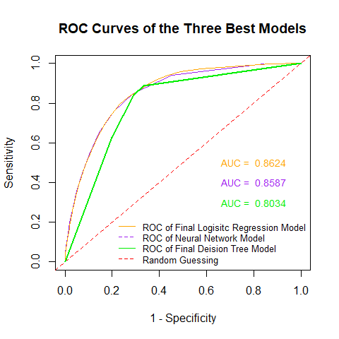

Comparing the ROC curves of the final logistic regression, neural network, and final decision tree models, all of them are better than the random guess and the predictive powers for these underlying models are all acceptable. The AUC for the final logistic regression model ROC, however, is significantly larger than that of the other two models. Therefore, the final logistic regression model has a better predictive performance than the other two and is the best model to use for predictive modeling of the data set out of the three. This model can be used by the Portuguese banking institution, and maybe other institutions as well, to predict whether clients, old or new, will subscribe a term deposit using the same variables used in the data set.
